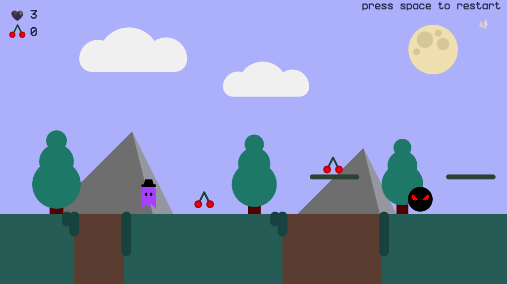

# Игра платформер

## Управление

| Клавиша | Действие |
|---------|----------|
| `←` / `A` | Движение влево |
| `→` / `D` | Движение вправо |
| `↑` / `W` | Прыжок |
| `M` | Включить/выключить музыку |
| `Space` | Рестарт игры |
